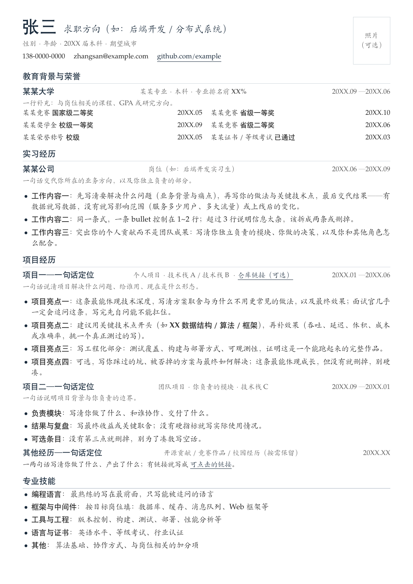
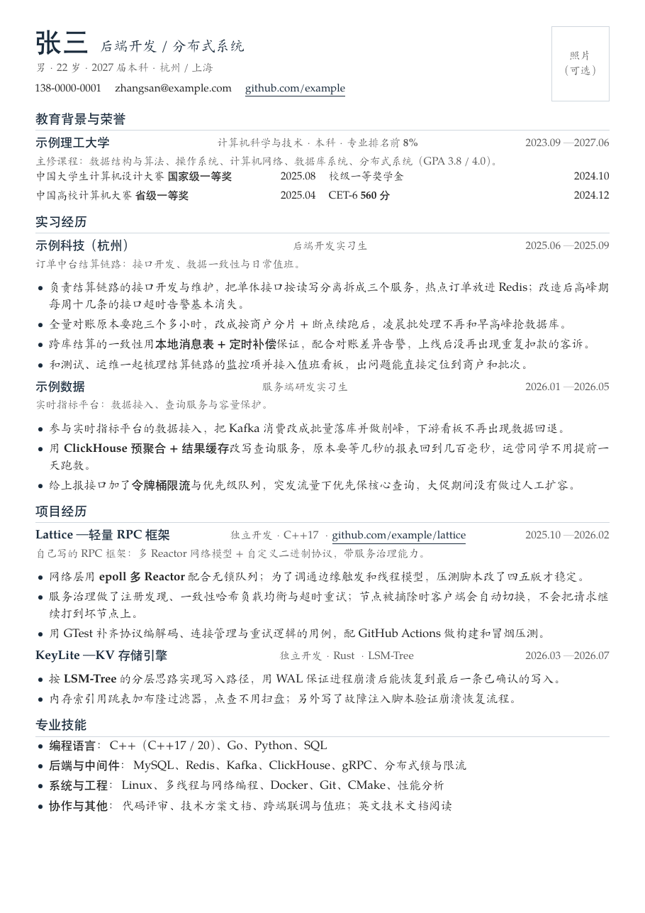
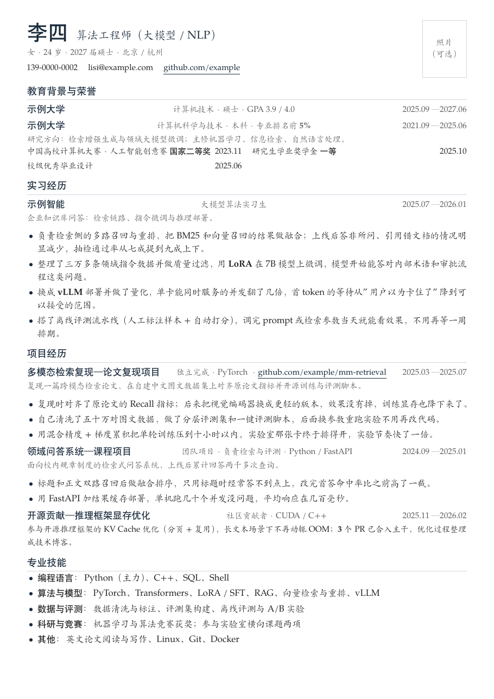
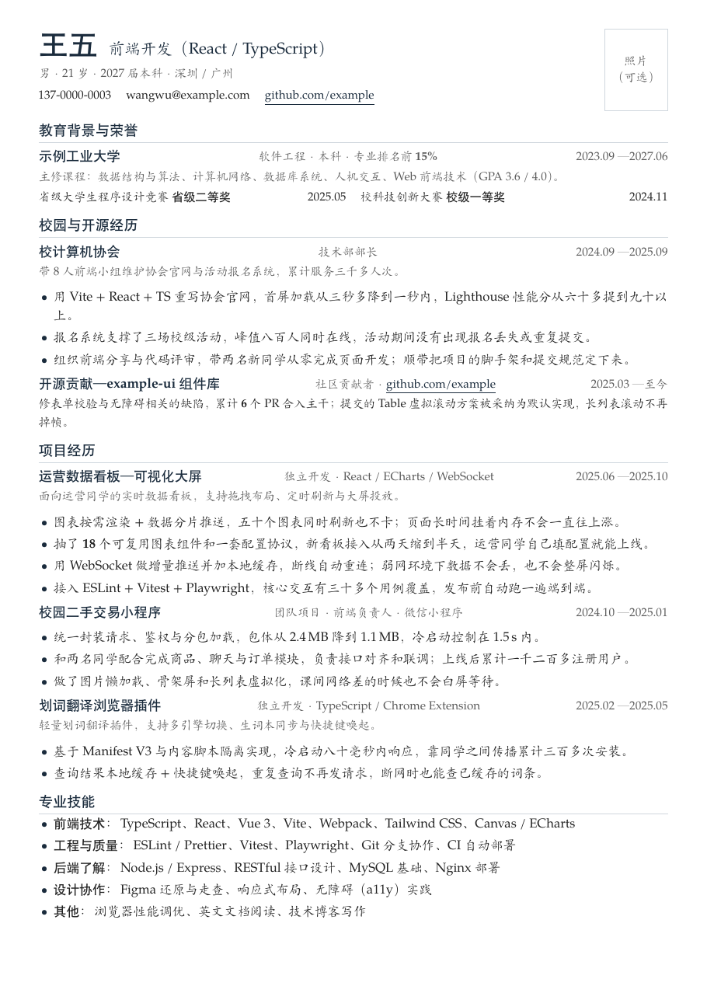
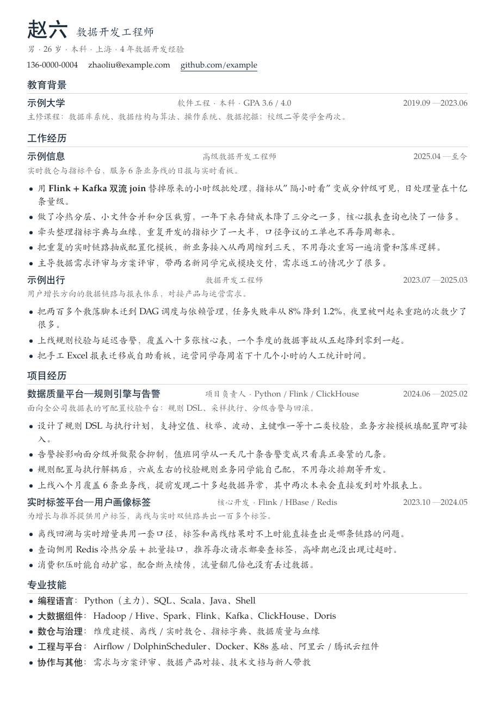

# 中文单页简历模板

分享一个一页纸中文简历模板（XeLaTeX 编译）。**如果对你有用，点个 ⭐ Star 支持一下～**

## 改法：交给 AI

把这个仓库丢给 Claude Code / Codex / DeepSeek Harness 这类 AI，照着说就行：

> 参照 main.tex 的版式和写法，把我的经历整理成一份一页纸简历，编译确认是 A4 单页：
> 【粘贴你的学校、实习、项目、技能、奖项】

要放证件照就把 `photo.jpg` 放进目录，让 AI 把照片位接上。Overleaf 上传 `main.tex` 后记得把 Compiler 选成 **XeLaTeX**；本地编译用 `make`（或 `xelatex main.tex`）。

## 示例

四份虚构简历，可直接当底稿：

MIT License
